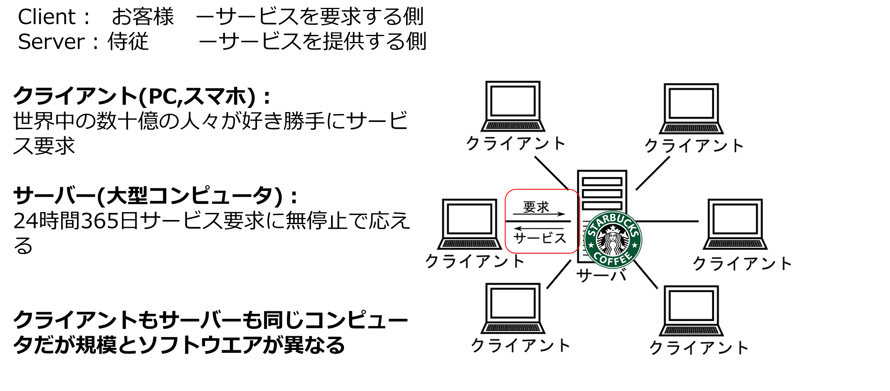
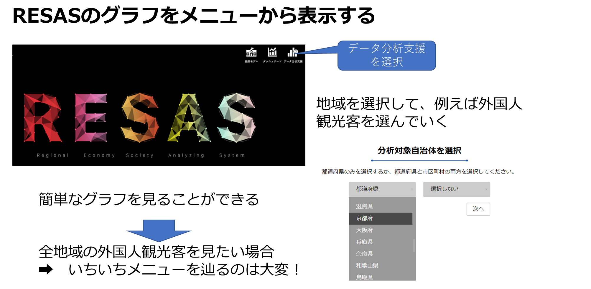
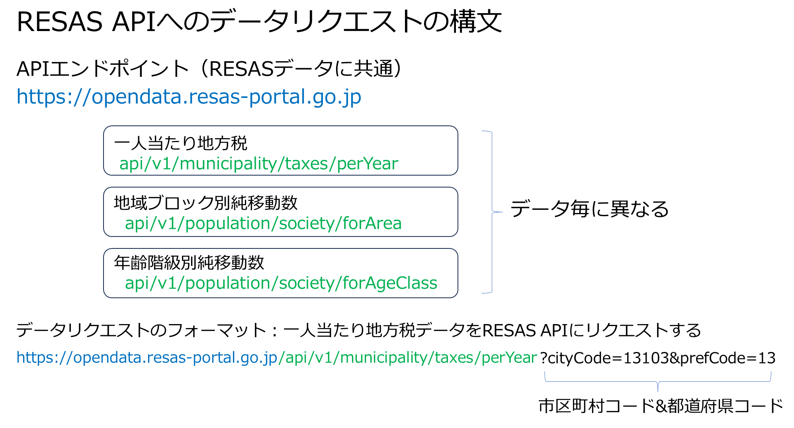
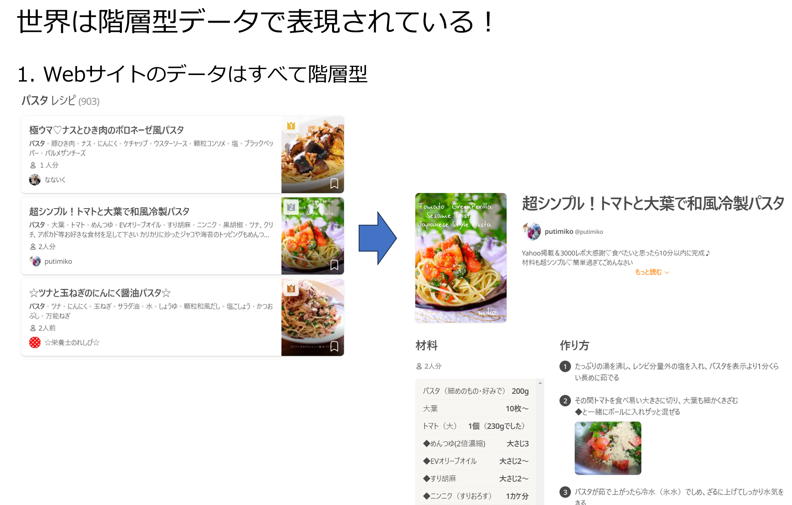
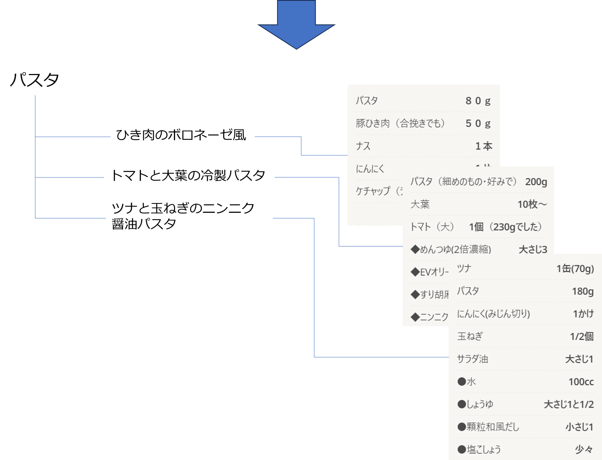

# ビッグデータとJson
#### この章では、プログラミングのデータ分析における重要性を実用的な視点から解説します。基礎編としては難易度が高いので、実用的なデータ分析プログラミングがどのようなものなのか、考え方を理解するようにしてください。
1. インターネットは、snsなどビッグデータの宝庫。大量に収集すればいろいろな発見がある。しかし、いちいちマウスでコピペは現実的ではない
2. 誰もがプログラミングで簡単にビッグデータを入手できるような仕組みが整いつつある
3. API(Application Programming Interface)は、インターネットのビッグデータをプログラミングで自動収集の仕組みの世界標準
4. APIによって収集するデータ形式は、ほとんどの場合JSON

# 1. ビッグデータの保管庫（サーバー）
### 1)  普段何気なく見ているホームページ、SNSはすべてサーバーに保管されたページを取り出してみている  
### 2)  サーバーはコンピュータという意味では皆さんのPCと仕組みは何ら変わらないが、以下のような点で違いがある
- PC ：サーバーに閲覧したいページをリクエストする
-  サーバー：世界中24時間365日、PCからページのリクエストを受け付けて必要なページを返却する
       
### 3) そのため、サーバーはPCに比べて忙しい！　以下のような性能が求められる。
-  無停止（高信頼性)
### 4) PC(スマホ）は、クライアントと総称される
- インターネットでwebサイトを閲覧するコンピュータの仕組みは、”クライアントサーバー”と呼ばれる
い




### 5) サーバーからビッグデータを効率的に収集する方法
- サーバーに保管しているデータをブラウザでページ毎に閲覧するのでは、効率的でない
- ブラウザの代わりに、プログラミングで効率的にデータを収集するために**API**が用意されている

# 2. API(Application Programming Interface)による大量データの収集
- プログラムから大量にデータ収集することを目的に作られたサーバーの窓口
- ブラウザでなくて、プログラムで一挙に大量データを取り込む
- APIにPC（クライアント）から欲しいデータをリクエストすると、APIはそのデータをサーバーから取り出してPCに返却する
- APIから返却されるデータ形式はJSONと呼ばれる形式で世界的に統一されている
　


# 3. 地域経済分析システム RESAS
- 地域のデータに特化した公的ビッグデータ提供サービス（サーバー）
[RESAS}(https://contest.resas-portal.go.jp/2022/resas.html)
- メニューから定型的なグラフも閲覧できるが、限られている（効率的でない）。
- そこで、RESAS APIを使って、地域ビッグデータを一気に取り込んで、pythonで様々な解析を行う

## RESASのグラフをメニューから選択する 




# 実習 RESAS API キーを取得する
- APIキー：アクセス権限をユーザー個々人に割り当てるためのキー。 APIを使うためにこのはキーが必要。
- キーは、ID, パスワードと同様な認証情報。プログラムから発行する認証情報ということでキーと呼ぶ
- 以下の手順でAPIキーを入手すること。API専用サイトは以下。  
  https://opendata.resas-portal.go.jp/
- 以下のページの下方の利用登録を押して必要な事項を記入（メール利用可能なアドレスを使う）して仮登録


- 仮登録すると、以下のような本登録メールが送られてくる。URLをクリックする


- 無事登録が終わると以下の画面になる。APIキーをpythonで使うのでコピペして自分にメールするなど紛失しないように保存する


# 4. RESAS API プログラミング
- RESASの多様なデータから特定のデータを指定して取り込むためのプログラミング。以下のリンクの左ウインドウに取得できるデータが表示されている。  
https://opendata.resas-portal.go.jp/docs/api/v1/index.html
- これらのメニューから、例えば。**一人あたり地方税** を選ぶと、さらに都道府県、市区町村を指定できることがわかる。
- 都道府県、市区町村コードは統一コードがある（以下）  
http://www.tt.rim.or.jp/~ishato/tiri/code/code.htm
- APIから返却されるデータは**Json形式**で階層型になっている

例1. 一人当たり地方税データを取得するAPIプログラミング  
APIには利用方法を記述した仕様が必ずある。税金データを取得するAPI仕様  
https://opendata.resas-portal.go.jp/docs/api/v1/municipality/taxes/perYear.html  

1. 上記仕様の先頭にある以下のURLが、プログラムのどこに対応するのかを理解すること。  
GET api/v1/municipality/taxes/perYea  
2. 仕様のparametersの記述が、プログラムのどこに対応するのかを理解すること。  
   - 仕様のサイドメニュー上のほうにリンクがある。これもプログラムと対比すること
3. 仕様のResponsesの記述は返却されるデータ項目(JSON)  
   -  このデータ項目がpprint.pprint(d)で表示されることを理解すること
  
api_key={"X-API-KEY":""}の" ”内に、APIキーを貼り付けて実行




```python
import json
import urllib.parse
import urllib.request
import pprint
import pandas as pd

url_base = 'https://opendata.resas-portal.go.jp/api/v1/municipality/taxes/perYear'

parameter = {'prefCode': 13, 'cityCode': 13103} #東京都　港区
url = url_base + '?' + urllib.parse.urlencode(parameter)
print(url)
api_key={"X-API-KEY":"Bi0mpfnfqrVq6XttdXknIb8tTZTbxrLlebbRpBYg"}
req = urllib.request.Request(url, headers=api_key)


with urllib.request.urlopen(req) as response:
    data = response.read()

d = json.loads(data.decode())

pprint.pprint(d)
```

    https://opendata.resas-portal.go.jp/api/v1/municipality/taxes/perYear?prefCode=13&cityCode=13103
    {'message': None,
     'result': {'cityCode': '13103',
                'cityName': '港区',
                'data': [{'value': 335, 'year': 2008},
                         {'value': 326, 'year': 2009},
                         {'value': 286, 'year': 2010},
                         {'value': 277, 'year': 2011},
                         {'value': 254, 'year': 2012},
                         {'value': 262, 'year': 2013},
                         {'value': 304, 'year': 2014},
                         {'value': 292, 'year': 2015},
                         {'value': 308, 'year': 2016},
                         {'value': 303, 'year': 2017},
                         {'value': 304, 'year': 2018},
                         {'value': 331, 'year': 2019},
                         {'value': 320, 'year': 2020},
                         {'value': 337, 'year': 2021}],
                'prefCode': 13,
                'prefName': '東京都'}}
    

# 演習1. 外国人観光客データの取得
  
**指定地域への国籍別訪問者数**のRESAS API仕様（以下）を読んで、下記の条件で来日外国人のデータを取得せよ。（基本的に
上記のコードを修正して作成すればよい）
https://opendata.resas-portal.go.jp/docs/api/v1/tourism/foreigners/forFrom.html

- year 2019, prefCode 埼玉のコード,purpose': 1
- 
Year 2019, prefCoed 東京のコー,purpose': 1   


```python
import json
import urllib.parse
import urllib.request
import pprint
import pandas as pd


```

    https://opendata.resas-portal.go.jp/api/v1/tourism/foreigners/forFrom?year=2019&prefCode=11&purpose=1
    {'message': None,
     'result': {'changes': [{'countryCode': '103',
                             'countryName': '韓国',
                             'data': [{'quarter': 1, 'value': 8598, 'year': 2019},
                                      {'quarter': 2, 'value': 15552, 'year': 2019},
                                      {'quarter': 3, 'value': 10367, 'year': 2019},
                                      {'quarter': 4, 'value': 9884, 'year': 2019}]},
                            {'countryCode': '105',
                             'countryName': '中国',
                             'data': [{'quarter': 1, 'value': 11508, 'year': 2019},
                                      {'quarter': 2, 'value': 24033, 'year': 2019},
                                      {'quarter': 3, 'value': 17594, 'year': 2019},
                                      {'quarter': 4,
                                       'value': 15970,
                                       'year': 2019}]},
                            {'countryCode': '106',
                             'countryName': '台湾',
                             'data': [{'quarter': 1, 'value': 9456, 'year': 2019},
                                      {'quarter': 2, 'value': 19165, 'year': 2019},
                                      {'quarter': 3, 'value': 12584, 'year': 2019},
                                      {'quarter': 4,
                                       'value': 12223,
                                       'year': 2019}]},
                            {'countryCode': '108',
                             'countryName': '香港',
                             'data': [{'quarter': 1, 'value': 1481, 'year': 2019},
                                      {'quarter': 2, 'value': 8583, 'year': 2019},
                                      {'quarter': 3, 'value': 3683, 'year': 2019},
                                      {'quarter': 4, 'value': 7532, 'year': 2019}]},
                            {'countryCode': '110',
                             'countryName': 'ベトナム',
                             'data': [{'quarter': 1, 'value': 7432, 'year': 2019},
                                      {'quarter': 2, 'value': 4959, 'year': 2019},
                                      {'quarter': 3, 'value': 2131, 'year': 2019},
                                      {'quarter': 4, 'value': 3842, 'year': 2019}]},
                            {'countryCode': '111',
                             'countryName': 'タイ',
                             'data': [{'quarter': 1, 'value': 4152, 'year': 2019},
                                      {'quarter': 2, 'value': 9118, 'year': 2019},
                                      {'quarter': 3, 'value': 6160, 'year': 2019},
                                      {'quarter': 4, 'value': 6189, 'year': 2019}]},
                            {'countryCode': '112',
                             'countryName': 'シンガポール',
                             'data': [{'quarter': 1, 'value': 306, 'year': 2019},
                                      {'quarter': 2, 'value': 1059, 'year': 2019},
                                      {'quarter': 3, 'value': 217, 'year': 2019},
                                      {'quarter': 4, 'value': 319, 'year': 2019}]},
                            {'countryCode': '113',
                             'countryName': 'マレーシア',
                             'data': [{'quarter': 1, 'value': 1716, 'year': 2019},
                                      {'quarter': 2, 'value': 2350, 'year': 2019},
                                      {'quarter': 3, 'value': 1362, 'year': 2019},
                                      {'quarter': 4, 'value': 2682, 'year': 2019}]},
                            {'countryCode': '117',
                             'countryName': 'フィリピン',
                             'data': [{'quarter': 1, 'value': 2716, 'year': 2019},
                                      {'quarter': 2, 'value': 4031, 'year': 2019},
                                      {'quarter': 3, 'value': 3297, 'year': 2019},
                                      {'quarter': 4, 'value': 5471, 'year': 2019}]},
                            {'countryCode': '118',
                             'countryName': 'インドネシア',
                             'data': [{'quarter': 1, 'value': 1429, 'year': 2019},
                                      {'quarter': 2, 'value': 2076, 'year': 2019},
                                      {'quarter': 3, 'value': 920, 'year': 2019},
                                      {'quarter': 4, 'value': 2060, 'year': 2019}]},
                            {'countryCode': '123',
                             'countryName': 'インド',
                             'data': [{'quarter': 1, 'value': 0, 'year': 2019},
                                      {'quarter': 2, 'value': 431, 'year': 2019},
                                      {'quarter': 3, 'value': 1558, 'year': 2019},
                                      {'quarter': 4, 'value': 1112, 'year': 2019}]},
                            {'countryCode': '205',
                             'countryName': '英国',
                             'data': [{'quarter': 1, 'value': 478, 'year': 2019},
                                      {'quarter': 2, 'value': 2117, 'year': 2019},
                                      {'quarter': 3, 'value': 0, 'year': 2019},
                                      {'quarter': 4, 'value': 4015, 'year': 2019}]},
                            {'countryCode': '210',
                             'countryName': 'フランス',
                             'data': [{'quarter': 1, 'value': 780, 'year': 2019},
                                      {'quarter': 2, 'value': 695, 'year': 2019},
                                      {'quarter': 3, 'value': 1306, 'year': 2019},
                                      {'quarter': 4, 'value': 391, 'year': 2019}]},
                            {'countryCode': '213',
                             'countryName': 'ドイツ',
                             'data': [{'quarter': 1, 'value': 1644, 'year': 2019},
                                      {'quarter': 2, 'value': 665, 'year': 2019},
                                      {'quarter': 3, 'value': 1671, 'year': 2019},
                                      {'quarter': 4, 'value': 720, 'year': 2019}]},
                            {'countryCode': '218',
                             'countryName': 'スペイン',
                             'data': [{'quarter': 1, 'value': 0, 'year': 2019},
                                      {'quarter': 2, 'value': 468, 'year': 2019},
                                      {'quarter': 3, 'value': 319, 'year': 2019},
                                      {'quarter': 4, 'value': 212, 'year': 2019}]},
                            {'countryCode': '220',
                             'countryName': 'イタリア',
                             'data': [{'quarter': 1, 'value': 251, 'year': 2019},
                                      {'quarter': 2, 'value': 219, 'year': 2019},
                                      {'quarter': 3, 'value': 402, 'year': 2019},
                                      {'quarter': 4, 'value': 1063, 'year': 2019}]},
                            {'countryCode': '224',
                             'countryName': 'ロシア',
                             'data': [{'quarter': 1, 'value': 0, 'year': 2019},
                                      {'quarter': 2, 'value': 0, 'year': 2019},
                                      {'quarter': 3, 'value': 0, 'year': 2019},
                                      {'quarter': 4, 'value': 675, 'year': 2019}]},
                            {'countryCode': '302',
                             'countryName': 'カナダ',
                             'data': [{'quarter': 1, 'value': 1815, 'year': 2019},
                                      {'quarter': 2, 'value': 1689, 'year': 2019},
                                      {'quarter': 3, 'value': 639, 'year': 2019},
                                      {'quarter': 4, 'value': 539, 'year': 2019}]},
                            {'countryCode': '304',
                             'countryName': '米国',
                             'data': [{'quarter': 1, 'value': 2585, 'year': 2019},
                                      {'quarter': 2, 'value': 5060, 'year': 2019},
                                      {'quarter': 3, 'value': 6107, 'year': 2019},
                                      {'quarter': 4, 'value': 4863, 'year': 2019}]},
                            {'countryCode': '601',
                             'countryName': 'オーストラリア',
                             'data': [{'quarter': 1, 'value': 2031, 'year': 2019},
                                      {'quarter': 2, 'value': 1244, 'year': 2019},
                                      {'quarter': 3, 'value': 608, 'year': 2019},
                                      {'quarter': 4,
                                       'value': 1954,
                                       'year': 2019}]}],
                'prefCode': '11',
                'prefName': '埼玉県',
                'purpose': 1,
                'year': 2019}}
    


## パスを記述して特定のデータを取り出す


- 大韓民国を取り出す
- 台湾を取り出す


```python
d['result']['changes'][0]['countryName']
```


    '大韓民国'


# 演習2.
1. 'data'にたどり着いてみる。
2. 更に第2四半期の訪問者数を表示するにはどうしたらよいか


```python

```


    15552


# 演習3.
## 'countryName', 'data'  を連続して表示する
1. 以下のプログラムの出力結果をみて、'country name'  'data' を表示できるように修正してみてください。
1. 更に、'data'中の第1四半期～第4四半期の来訪者数を合計して表示する方法を考えてみてください。


```python

```

    {'countryCode': '103', 'countryName': '大韓民国', 'data': [{'year': 2019, 'quarter': 1, 'value': 8598}, {'year': 2019, 'quarter': 2, 'value': 15552}, {'year': 2019, 'quarter': 3, 'value': 10367}, {'year': 2019, 'quarter': 4, 'value': 9884}]}
    {'countryCode': '105', 'countryName': '中華人民共和国', 'data': [{'year': 2019, 'quarter': 1, 'value': 11508}, {'year': 2019, 'quarter': 2, 'value': 24033}, {'year': 2019, 'quarter': 3, 'value': 17594}, {'year': 2019, 'quarter': 4, 'value': 15970}]}
    {'countryCode': '106', 'countryName': '台湾', 'data': [{'year': 2019, 'quarter': 1, 'value': 9456}, {'year': 2019, 'quarter': 2, 'value': 19165}, {'year': 2019, 'quarter': 3, 'value': 12584}, {'year': 2019, 'quarter': 4, 'value': 12223}]}
    {'countryCode': '108', 'countryName': '香港', 'data': [{'year': 2019, 'quarter': 1, 'value': 1481}, {'year': 2019, 'quarter': 2, 'value': 8583}, {'year': 2019, 'quarter': 3, 'value': 3683}, {'year': 2019, 'quarter': 4, 'value': 7532}]}
    {'countryCode': '110', 'countryName': 'ベトナム', 'data': [{'year': 2019, 'quarter': 1, 'value': 7432}, {'year': 2019, 'quarter': 2, 'value': 4959}, {'year': 2019, 'quarter': 3, 'value': 2131}, {'year': 2019, 'quarter': 4, 'value': 3842}]}
    {'countryCode': '111', 'countryName': 'タイ', 'data': [{'year': 2019, 'quarter': 1, 'value': 4152}, {'year': 2019, 'quarter': 2, 'value': 9118}, {'year': 2019, 'quarter': 3, 'value': 6160}, {'year': 2019, 'quarter': 4, 'value': 6189}]}
    {'countryCode': '112', 'countryName': 'シンガポール', 'data': [{'year': 2019, 'quarter': 1, 'value': 306}, {'year': 2019, 'quarter': 2, 'value': 1059}, {'year': 2019, 'quarter': 3, 'value': 217}, {'year': 2019, 'quarter': 4, 'value': 319}]}
    {'countryCode': '113', 'countryName': 'マレーシア', 'data': [{'year': 2019, 'quarter': 1, 'value': 1716}, {'year': 2019, 'quarter': 2, 'value': 2350}, {'year': 2019, 'quarter': 3, 'value': 1362}, {'year': 2019, 'quarter': 4, 'value': 2682}]}
    {'countryCode': '117', 'countryName': 'フィリピン', 'data': [{'year': 2019, 'quarter': 1, 'value': 2716}, {'year': 2019, 'quarter': 2, 'value': 4031}, {'year': 2019, 'quarter': 3, 'value': 3297}, {'year': 2019, 'quarter': 4, 'value': 5471}]}
    {'countryCode': '118', 'countryName': 'インドネシア', 'data': [{'year': 2019, 'quarter': 1, 'value': 1429}, {'year': 2019, 'quarter': 2, 'value': 2076}, {'year': 2019, 'quarter': 3, 'value': 920}, {'year': 2019, 'quarter': 4, 'value': 2060}]}
    {'countryCode': '123', 'countryName': 'インド', 'data': [{'year': 2019, 'quarter': 1, 'value': 0}, {'year': 2019, 'quarter': 2, 'value': 431}, {'year': 2019, 'quarter': 3, 'value': 1558}, {'year': 2019, 'quarter': 4, 'value': 1112}]}
    {'countryCode': '205', 'countryName': '英国', 'data': [{'year': 2019, 'quarter': 1, 'value': 478}, {'year': 2019, 'quarter': 2, 'value': 2117}, {'year': 2019, 'quarter': 3, 'value': 0}, {'year': 2019, 'quarter': 4, 'value': 4015}]}
    {'countryCode': '210', 'countryName': 'フランス', 'data': [{'year': 2019, 'quarter': 1, 'value': 780}, {'year': 2019, 'quarter': 2, 'value': 695}, {'year': 2019, 'quarter': 3, 'value': 1306}, {'year': 2019, 'quarter': 4, 'value': 391}]}
    {'countryCode': '213', 'countryName': 'ドイツ', 'data': [{'year': 2019, 'quarter': 1, 'value': 1644}, {'year': 2019, 'quarter': 2, 'value': 665}, {'year': 2019, 'quarter': 3, 'value': 1671}, {'year': 2019, 'quarter': 4, 'value': 720}]}
    {'countryCode': '218', 'countryName': 'スペイン', 'data': [{'year': 2019, 'quarter': 1, 'value': 0}, {'year': 2019, 'quarter': 2, 'value': 468}, {'year': 2019, 'quarter': 3, 'value': 319}, {'year': 2019, 'quarter': 4, 'value': 212}]}
    {'countryCode': '220', 'countryName': 'イタリア', 'data': [{'year': 2019, 'quarter': 1, 'value': 251}, {'year': 2019, 'quarter': 2, 'value': 219}, {'year': 2019, 'quarter': 3, 'value': 402}, {'year': 2019, 'quarter': 4, 'value': 1063}]}
    {'countryCode': '224', 'countryName': 'ロシア', 'data': [{'year': 2019, 'quarter': 1, 'value': 0}, {'year': 2019, 'quarter': 2, 'value': 0}, {'year': 2019, 'quarter': 3, 'value': 0}, {'year': 2019, 'quarter': 4, 'value': 675}]}
    {'countryCode': '302', 'countryName': 'カナダ', 'data': [{'year': 2019, 'quarter': 1, 'value': 1815}, {'year': 2019, 'quarter': 2, 'value': 1689}, {'year': 2019, 'quarter': 3, 'value': 639}, {'year': 2019, 'quarter': 4, 'value': 539}]}
    {'countryCode': '304', 'countryName': 'アメリカ合衆国', 'data': [{'year': 2019, 'quarter': 1, 'value': 2585}, {'year': 2019, 'quarter': 2, 'value': 5060}, {'year': 2019, 'quarter': 3, 'value': 6107}, {'year': 2019, 'quarter': 4, 'value': 4863}]}
    {'countryCode': '601', 'countryName': 'オーストラリア', 'data': [{'year': 2019, 'quarter': 1, 'value': 2031}, {'year': 2019, 'quarter': 2, 'value': 1244}, {'year': 2019, 'quarter': 3, 'value': 608}, {'year': 2019, 'quarter': 4, 'value': 1954}]}
    


```python
import codecs
import pandas as pd

```

    韓国 [{'year': 2019, 'quarter': 1, 'value': 8598}, {'year': 2019, 'quarter': 2, 'value': 15552}, {'year': 2019, 'quarter': 3, 'value': 10367}, {'year': 2019, 'quarter': 4, 'value': 9884}]
    韓国 44401
    中国 [{'year': 2019, 'quarter': 1, 'value': 11508}, {'year': 2019, 'quarter': 2, 'value': 24033}, {'year': 2019, 'quarter': 3, 'value': 17594}, {'year': 2019, 'quarter': 4, 'value': 15970}]
    中国 69105
    台湾 [{'year': 2019, 'quarter': 1, 'value': 9456}, {'year': 2019, 'quarter': 2, 'value': 19165}, {'year': 2019, 'quarter': 3, 'value': 12584}, {'year': 2019, 'quarter': 4, 'value': 12223}]
    台湾 53428
    香港 [{'year': 2019, 'quarter': 1, 'value': 1481}, {'year': 2019, 'quarter': 2, 'value': 8583}, {'year': 2019, 'quarter': 3, 'value': 3683}, {'year': 2019, 'quarter': 4, 'value': 7532}]
    香港 21279
    ベトナム [{'year': 2019, 'quarter': 1, 'value': 7432}, {'year': 2019, 'quarter': 2, 'value': 4959}, {'year': 2019, 'quarter': 3, 'value': 2131}, {'year': 2019, 'quarter': 4, 'value': 3842}]
    ベトナム 18364
    タイ [{'year': 2019, 'quarter': 1, 'value': 4152}, {'year': 2019, 'quarter': 2, 'value': 9118}, {'year': 2019, 'quarter': 3, 'value': 6160}, {'year': 2019, 'quarter': 4, 'value': 6189}]
    タイ 25619
    シンガポール [{'year': 2019, 'quarter': 1, 'value': 306}, {'year': 2019, 'quarter': 2, 'value': 1059}, {'year': 2019, 'quarter': 3, 'value': 217}, {'year': 2019, 'quarter': 4, 'value': 319}]
    シンガポール 1901
    マレーシア [{'year': 2019, 'quarter': 1, 'value': 1716}, {'year': 2019, 'quarter': 2, 'value': 2350}, {'year': 2019, 'quarter': 3, 'value': 1362}, {'year': 2019, 'quarter': 4, 'value': 2682}]
    マレーシア 8110
    フィリピン [{'year': 2019, 'quarter': 1, 'value': 2716}, {'year': 2019, 'quarter': 2, 'value': 4031}, {'year': 2019, 'quarter': 3, 'value': 3297}, {'year': 2019, 'quarter': 4, 'value': 5471}]
    フィリピン 15515
    インドネシア [{'year': 2019, 'quarter': 1, 'value': 1429}, {'year': 2019, 'quarter': 2, 'value': 2076}, {'year': 2019, 'quarter': 3, 'value': 920}, {'year': 2019, 'quarter': 4, 'value': 2060}]
    インドネシア 6485
    インド [{'year': 2019, 'quarter': 1, 'value': 0}, {'year': 2019, 'quarter': 2, 'value': 431}, {'year': 2019, 'quarter': 3, 'value': 1558}, {'year': 2019, 'quarter': 4, 'value': 1112}]
    インド 3101
    英国 [{'year': 2019, 'quarter': 1, 'value': 478}, {'year': 2019, 'quarter': 2, 'value': 2117}, {'year': 2019, 'quarter': 3, 'value': 0}, {'year': 2019, 'quarter': 4, 'value': 4015}]
    英国 6610
    フランス [{'year': 2019, 'quarter': 1, 'value': 780}, {'year': 2019, 'quarter': 2, 'value': 695}, {'year': 2019, 'quarter': 3, 'value': 1306}, {'year': 2019, 'quarter': 4, 'value': 391}]
    フランス 3172
    ドイツ [{'year': 2019, 'quarter': 1, 'value': 1644}, {'year': 2019, 'quarter': 2, 'value': 665}, {'year': 2019, 'quarter': 3, 'value': 1671}, {'year': 2019, 'quarter': 4, 'value': 720}]
    ドイツ 4700
    スペイン [{'year': 2019, 'quarter': 1, 'value': 0}, {'year': 2019, 'quarter': 2, 'value': 468}, {'year': 2019, 'quarter': 3, 'value': 319}, {'year': 2019, 'quarter': 4, 'value': 212}]
    スペイン 999
    イタリア [{'year': 2019, 'quarter': 1, 'value': 251}, {'year': 2019, 'quarter': 2, 'value': 219}, {'year': 2019, 'quarter': 3, 'value': 402}, {'year': 2019, 'quarter': 4, 'value': 1063}]
    イタリア 1935
    ロシア [{'year': 2019, 'quarter': 1, 'value': 0}, {'year': 2019, 'quarter': 2, 'value': 0}, {'year': 2019, 'quarter': 3, 'value': 0}, {'year': 2019, 'quarter': 4, 'value': 675}]
    ロシア 675
    カナダ [{'year': 2019, 'quarter': 1, 'value': 1815}, {'year': 2019, 'quarter': 2, 'value': 1689}, {'year': 2019, 'quarter': 3, 'value': 639}, {'year': 2019, 'quarter': 4, 'value': 539}]
    カナダ 4682
    米国 [{'year': 2019, 'quarter': 1, 'value': 2585}, {'year': 2019, 'quarter': 2, 'value': 5060}, {'year': 2019, 'quarter': 3, 'value': 6107}, {'year': 2019, 'quarter': 4, 'value': 4863}]
    米国 18615
    オーストラリア [{'year': 2019, 'quarter': 1, 'value': 2031}, {'year': 2019, 'quarter': 2, 'value': 1244}, {'year': 2019, 'quarter': 3, 'value': 608}, {'year': 2019, 'quarter': 4, 'value': 1954}]
    オーストラリア 5837
    

### Json形式はビッグデータを表現する代表的な階層形式。しかし、階層形式データは、Json以外にも日常の多くの場面で見られる






```python

```
